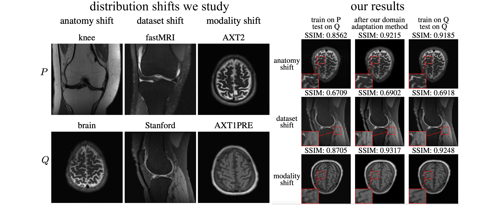

# Test-time training for deep-learning-based compressed sensing

Check out our colab-demo for a quick example on how test-time training works for multi-coil accelerated MRI reconstruction:

 

This repository provides code for reproducing the results in the paper:

**''Test-Time Training Can Close the Natural Distribution Shift Performance Gap in Deep Learning Based Compressed Sensing,''** by anonymous authors.

Code by: Anonymous authors

***

In order to study our domain adaptation method for multiple notions of robustness, the considered problem in the paper is accelerated MRI reconstruction where the task is to reconstruct an image from a few measurements. In this regard, we specifically provide experiments to test our method for [U-Net](https://github.com/MLI-lab/robustness_interventions_cs/tree/master/unet) and end-to-end variational network ([VarNet](https://github.com/MLI-lab/robustness_interventions_cs/tree/master/varnet)) under three natural distribution shifts, each designated with a jupyter notebook: 

(i) anatomy_shift.ipynb, 

(ii) dataset_shift.ipynb, and

(iii) modality_shift.ipynb.

### List of contents

* [Setup and installation](#Setup-and-installation) 

* [Datasets and model checkpoints](#Dataset) 

* [Running the code](#Running-the-code) 

* [References](#References) 

* [Citation](#Citation)

* [License](#License)
***

# Setup and installation

On a normal computer, it takes aproximately 10 minutes to install all the required softwares and packages.

### OS requirements

The code has been tested on the following operating system:

	Linux: Ubuntu 20.04.2

### Python dependencies

To reproduce the results by running each of the jupyter notebooks, the following softwares are required. Assuming the experiment is being performed in a docker container or a linux machine, the following libraries and packages need to be installed:

        apt-get update
        apt-get install python3.6     # --> or any other system-specific command for installing python3 on your system.
		pip install jupyter
		pip install numpy
		pip install matplotlib
		pip install sigpy
		pip install h5py
		pip install scikit-image
		pip install runstats
		pip install pytorch_msssim
		pip install pytorch-lightning==0.7.5
		pip install test-tube
		pip install Pillow

If pip does not come with the version of python you installed, install pip manually from [here](https://ehmatthes.github.io/pcc/chapter_12/installing_pip.html). Also, install pytorch from [here](https://pytorch.org/) according to your system specifications. 

Install bart toolbox by following the instructions on their [home page](https://mrirecon.github.io/bart/).

**Note.** After installing pytorch lightning, if you run into a 'state-dict' error for VarNet, you might need to replace parsing.py in /opt/conda/lib/python3.7/site-packages/pytorch_lightning/utilities/parsing.py from [here](https://github.com/PyTorchLightning/PyTorch-Lightning/blob/0.8.1/pytorch_lightning/utilities/parsing.py#L96-L128). This is due to the version mismatch in their recent release (0.7.5).

# Datasets and model checkpoints

The experiments are performed on the following datasets:

The [fastMRI](https://fastmri.org/dataset) dataset (both knee and brain datasets are required).  
The [Stanford](http://mridata.org/list?project=Stanford%20Fullysampled%203D%20FSE%20Knees) dataset (all 19 volumes should be downloaded).  

In a [train_data](https://github.com/MLI-lab/robustness_interventions_cs/tree/master/unet/train_data) folder, we specify which files from the 2 datasets above are used for training and testing. In our [training notebook](https://github.com/MLI-lab/robustness_interventions_cs/blob/master/unet/train.ipynb), we show how to access those file names.

To directly run the experiments without training models from the scratch, one can use our model checkpoints for [U-Net](https://drive.google.com/uc?id=1Le_JF1ZPzC_7bS1nj4XrG8fcIGrFBsJM&export=download) and [VarNet](https://drive.google.com/uc?id=1X091h7NdMTLwfPJJ_zEqQPGvLsX9Pomt&export=download).
However, we provide a [training code](https://github.com/MLI-lab/robustness_interventions_cs/blob/master/unet/train.ipynb) to reproduce model checkpoints as well.

# Running the code

You may simply clone this repository, enter U-Net's or VarNet's folder, and finally run each notebook to reproduce the results.  
**Note.** You need to download the necessary datasets and the checkpoints according to the experiment you intend to run.

# References

Code for training the U-Net and the VarNet is taken from the [fastMRI repository](https://github.com/facebookresearch/fastMRI/tree/master/models/unet) with modifications.  

# Citation

We'll update this section later.

# License

This project is covered by **Apache 2.0 License**.

