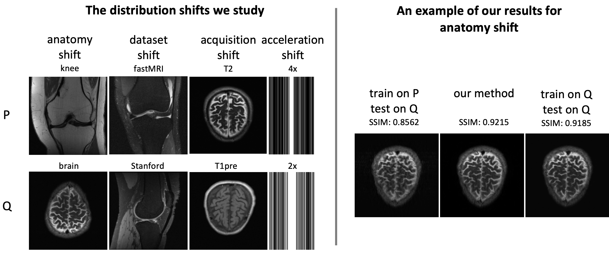

# A domain adaptation method for deep-learning-based compressed sensing

This repository provides code for reproducing the results in the paper:

**''Test-Time Training Can Close the Natural Distribution Shift Performance Gap in Deep Learning Based Compressed Sensing,''** by anonymous authors.

Code by: Anonymous authors

***

In order to study multiple notions of robustness, the considered problem in the paper is accelerated MRI reconstruction where the task is to reconstruct an image from a few measurements. In this regard, we specifically provide experiments to: 

(i) Generate and apply small, adversarial perturbations for un-trained methods like $\mathcal{l}_1$-norm minimization and un-trained neural networks (**adversarial_perturbations_untrained.ipynb**), 

(ii) generate and apply small, adversarial perturbations for trained neural networks like U-net and the end-to-end variational network (VarNet) (**adversarial_perturbations_trained.ipynb**),

(iii) perform a sample test to apply the models that have only seen samples from the fastMRI dataset to the Stanford set (**distribution_shift_fastMRI_to_Stanford.ipynb**), 

(iv) perform a sample test to apply the models that have only seen knee samples from the fastMRI dataset to a brain image (**distribution_shift_fastMRI_knee_to_brain.ipynb**),

(v) perform a sample test to apply the models that have only seen samples from the fastMRI dataset to a subset of challenging samples from the fastMRI dataset (**distribution_shift_fastMRI_to_adversarially_filtered_data.ipynb**),

(vi) put a small feature on the image and recover it using multiple image reconstruction methods (**small_features_artificial_fixed_information.ipynb**), 

(vii) reconstruct an image which contains a real-world pathology and measure how much of that feature is recovered (**small_features_real_worl_pathology.ipynb**),

(viii) and finally, check whether the choice of basis matters when evaluating the robustness of sparsity-based methods to adversarial perturbations (**adversarial_perturbations_basis_doesnt_matter.ipynb**).

### List of contents

* [Setup and installation](#Setup-and-installation) 

* [Dataset](#Dataset) 

* [Running the code](#Running-the-code) 

* [References](#References) 

* [Citation](#Citation)

* [License](#License)
***

# Setup and installation

On a normal computer, it takes aproximately 10 minutes to install all the required softwares and packages.

### OS requirements

The code has been tested on the following operating system:

	Linux: Ubuntu 20.04.2

### Python dependencies

To reproduce the results by running each of the jupyter notebooks, the following softwares are required. Assuming the experiment is being performed in a docker container or a linux machine, the following libraries and packages need to be installed:

        apt-get update
        apt-get install python3.6     # --> or any other system-specific command for installing python3 on your system.
		pip install jupyter
		pip install numpy
		pip install matplotlib
		pip install sigpy
		pip install h5py
		pip install scikit-image
		pip install runstats
		pip install pytorch_msssim
		pip install pytorch-lightning==0.7.5
		pip install test-tube
		pip install Pillow

If pip does not come with the version of python you installed, install pip manually from [here](https://ehmatthes.github.io/pcc/chapter_12/installing_pip.html). Also, install pytorch from [here](https://pytorch.org/) according to your system specifications. 

Install bart toolbox by following the instructions on their [home page](https://mrirecon.github.io/bart/).

**Note.** After installing pytorch lightning, if you run into a 'state-dict' error for VarNet, you might need to replace parsing.py in /opt/conda/lib/python3.7/site-packages/pytorch_lightning/utilities/parsing.py from [here](https://github.com/PyTorchLightning/PyTorch-Lightning/blob/0.8.1/pytorch_lightning/utilities/parsing.py#L96-L128). This is due to the version mismatch in their recent release (0.7.5).

# Datasets

The experiments are performed on the following datasets:

The [fastMRI](https://fastmri.org/dataset) dataset.

The [Stanford](https://rice.box.com/shared/static/4xk6nef26vk8uyes4wymtob5pbmcfdyd) dataset which we collected from [mridata.org](http://mridata.org/list?project=Stanford%20Fullysampled%203D%20FSE%20Knees).

The [adversarially-filtered](https://rice.box.com/shared/static/9h55fkst76e0k5f8te5xayy5jbysy18y) dataset which we created using the invertible Recurrent Inference Machine ([i-RIM](https://arxiv.org/pdf/1706.04008.pdf)).

# Running the code

You may simply clone this repository, enter U-Net's or VarNet's folder, and finally run each notebook to reproduce the results.  
**Note.** You need to download the necessary datasets and the checkpoints according to the experiment you intend to run.

# References

Code for training the U-net and VarNet is taken from the [fastMRI repository](https://github.com/facebookresearch/fastMRI/tree/master/models/unet) with minor modifications.  

# Citation

We'll update this section later.

# License

This project is covered by **Apache 2.0 License**.

